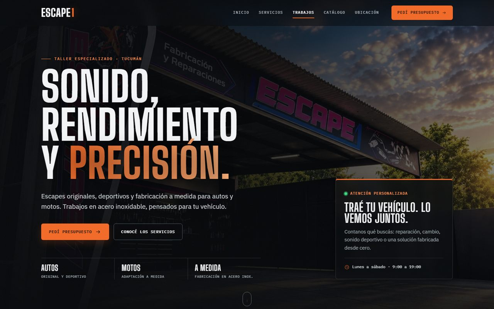
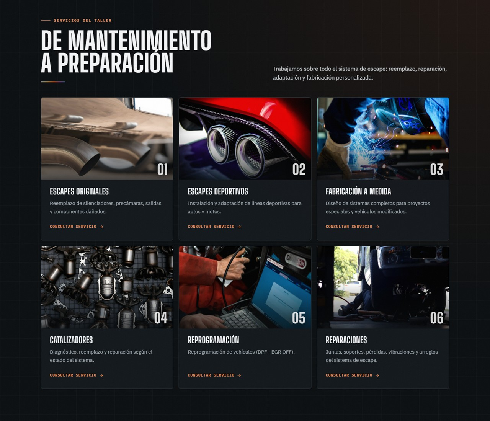
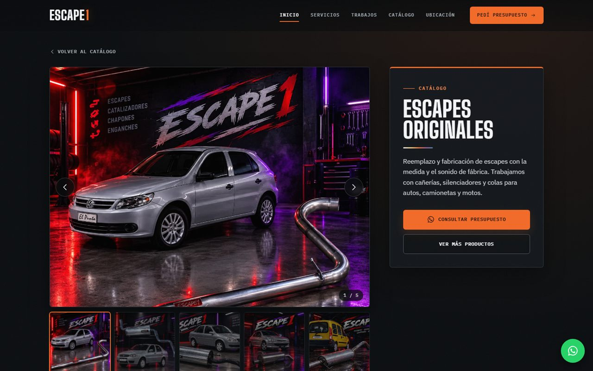
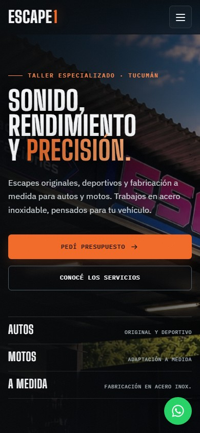

# Escape1: sitio web para taller de escapes

Sitio web para **Escape1**, un taller de escapes para autos y motos de San Miguel de Tucumán, Argentina. Desarrollado con **React** y **Vite** para un cliente real.

**🔗 Ver online: [escape1-opal.vercel.app](https://escape1-opal.vercel.app/)**



## Funcionalidades

- **Catálogo con fichas de producto:** cada categoría tiene su propia página (`#/catalogo/<producto>`) con visor de fotos, miniaturas y navegación con flechas del teclado.
- **Presupuestos y turnos por WhatsApp:** los formularios validan los datos y arman un mensaje prolijo que se abre directo en WhatsApp, el canal principal del taller con sus clientes. Desde un servicio o un producto, el formulario se precarga solo.
- **Galería de trabajos:** fotos y videos por categoría (autos y motos). Los videos se reproducen solos solo mientras están en pantalla, para ahorrar datos y batería, y se abren en un visor navegable.
- **Diseño responsive:** pensado primero para el celular, desde 360 px hasta pantallas grandes.
- **Animaciones sutiles:** aparición al hacer scroll, header que se compacta y franja de servicios en movimiento. Todo se desactiva si el usuario tiene activado "reducir movimiento".
- **Accesibilidad:** navegación completa por teclado, foco visible, textos para lectores de pantalla y "saltar al contenido".
- **Ubicación y contacto:** mapa embebido, horarios y contacto directo por WhatsApp, teléfono o email.

## Capturas

| Servicios | Ficha de producto | Celular |
|---|---|---|
|  |  |  |

## Tecnologías

- **React 19**: componentes funcionales y hooks.
- **Vite**: entorno de desarrollo y build.
- **CSS puro**: variables (design tokens), Grid, Flexbox y `clamp()` para tipografía fluida. Sin frameworks de estilos.
- **ESLint**: con las reglas de React Hooks.
- **Vercel**: hosting con despliegue automático desde GitHub.

Sin dependencias extra: el router de la ficha de producto, las animaciones de scroll y la integración con WhatsApp están hechos a mano.

## Cómo correrlo

Requiere [Node.js](https://nodejs.org/) en una versión LTS reciente.

```bash
git clone https://github.com/nico-git7/escape1-react.git
cd escape1-react
npm install
npm run dev
```

Abrí `http://localhost:5173`.

| Comando | Qué hace |
|---|---|
| `npm run dev` | Servidor de desarrollo con recarga en vivo |
| `npm run build` | Build de producción en `dist/` |
| `npm run preview` | Sirve el build localmente |
| `npm run lint` | Revisa el código con ESLint |

## Estructura

```
src/
├── App.jsx                  # Layout general y router (home / ficha de producto)
├── index.css                # Variables de diseño, reset y utilidades globales
├── components/
│   ├── Header.jsx           # Navegación con scroll-spy y menú mobile
│   ├── Footer.jsx
│   ├── Lightbox.jsx         # Visor de fotos y videos de la galería
│   ├── IconSprite.jsx       # Íconos SVG reutilizables
│   ├── MainHome.jsx         # Arma la home con todas las secciones
│   └── sections/            # Hero, Servicios, Galería, Catálogo, Formularios, Contacto…
├── pages/
│   └── CatalogDetail.jsx    # Ficha de cada producto del catálogo
├── data/
│   ├── catalog.js           # Productos del catálogo (fotos, textos, servicio asociado)
│   ├── gallery.js           # Fotos y videos de la galería
│   └── nav.js               # Links del menú
└── utils/
    ├── useHashRoute.js      # Router mínimo basado en el hash de la URL
    ├── useReveal.js         # Animación de aparición al hacer scroll
    └── whatsapp.js          # Número, formato de fechas y armado de mensajes
```

## Cómo actualizar el contenido

El contenido está separado del código, así que no hace falta tocar componentes:

- **Agregar un producto o cambiar sus fotos:** editar `src/data/catalog.js`.
- **Sumar fotos o videos a la galería:** subir el archivo a `public/img/galeria/` o `public/video/galeria/` y agregarlo en `src/data/gallery.js`.
- **Cambiar el número de WhatsApp:** `src/utils/whatsapp.js`.

## Créditos

Algunas fotos de servicios y categorías son de [Unsplash](https://unsplash.com/license), con licencia de uso libre. El detalle está en `public/img/stock/CREDITOS.txt`. Las fotos y videos de la galería y del catálogo son trabajos reales del taller.

---

Desarrollado por [@nico-git7](https://github.com/nico-git7).
